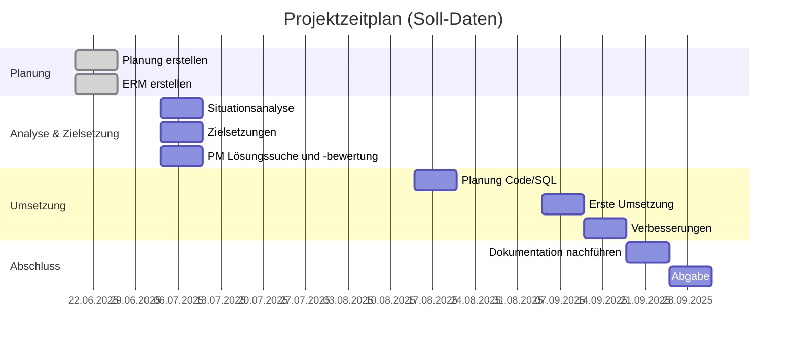
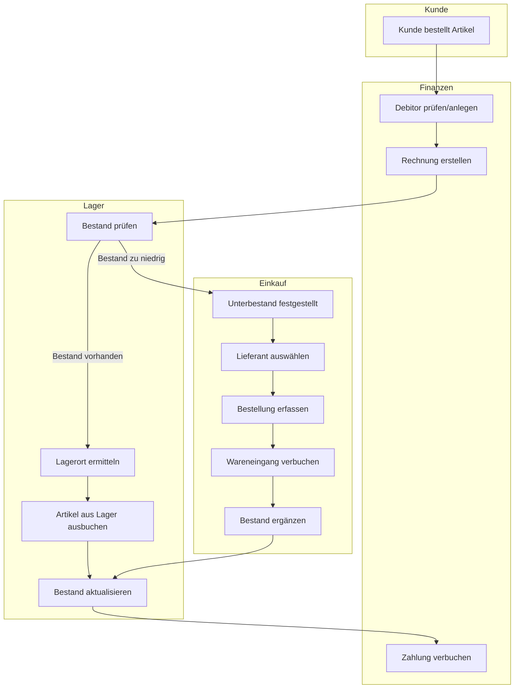
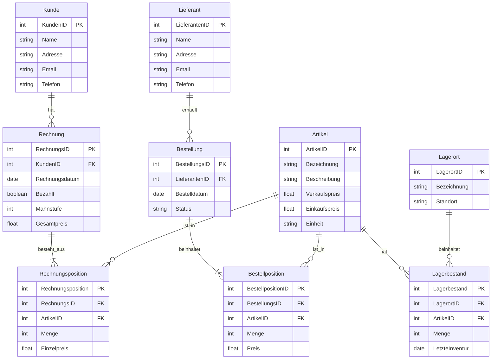
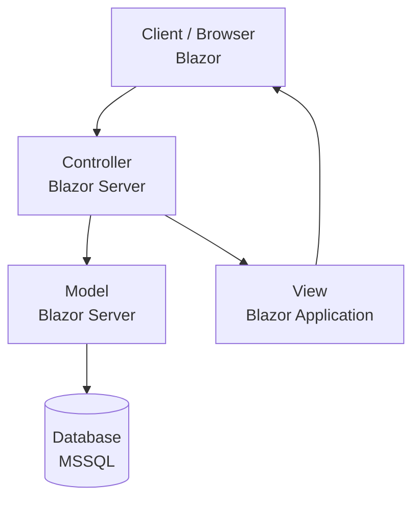

# Projektarbeit ERP LittleFlower

In dieser Arbeit geht es darum, ein ERP-System aufzubauen, inkl. ERM-Modellierung, Aufbau Datenbank in SQL-Server und Umsetzung mit Testfällen. Allenfalls werde ich gegen Schluss auch noch ein einfaches GUI dazu programmieren. Der Fokus liegt jedoch klar auf dem Aufbau der Datenbank und der Dokumentation.

## Projektmanagement

### Planungsentwurf

Ein erster Entwurf des Ablaufs der Arbeit sieht folgendermassen aus:

- ERM
  - Leistungsflussdiagramm
  - Korrelationsmatrix
  - Modell
- Projektmanagement
  - Situationsanalyse
  - Zielsetzungen (Stakeholder und funktional)
  - Lösungssuche und -bewertung (eingeschränkt)
  - Planung und Controlling (Earned Value Analyse)
- Anforderungsanalyse / Testfälle
- Umsetzung in SQL-Server
  - Datenbank und Tabellen inkl. Pkeys und Fkeys
  - Triggers?
- Umsetzung in Konsolen-App
  - 4.1 Verbindung zu DB wie?
- GUI
  - evtl. mit Blazor?

### Situationsanalyse LittleFlower

Die Firma LittleFlower hat ihren Fokus und ihre Stärke ganz klar auf der kreativen Seite. Super Ideen und schöne Umsetzungen. Was das Administrative anbelangt, wird alles von Hand auf Notizzettel geschrieben - Bestellungen, Rechnungen, Kundendaten, Lieferantendaten etc. Das ist klar ein Problem in der heutigen Zeit. So werden Aufträge vergessen, nicht alles Geld wird eingefordert und die Steuerverwaltung ist nicht zufrieden mit der Buchhaltung.

### Zielsetzungen

**Wen interessiert eine Verbesserung?**

| Stakeholder     | Interesse & Einfluss                                  |
| --------------- | ----------------------------------------------------- |
| Inhaber         | Finanzieller Erfolg                                   |
| Mitarbeitende   | Gute Arbeitsbedingungen, sicherer Job, klare Prozesse |
| IT/Technik-Team | Wartbare Systeme, gute Tools, stabile Infrastruktur   |

**Funktionale Ziele**

| Modul         | Ziel                                                         | Wichtigkeit |
| ------------- | ------------------------------------------------------------ | ----------- |
| Finanzmodul   | Kreditoren und Debitoren können erfasst und verwaltet werden | Muss        |
| Finanzmodul   | Umsatz pro Artikel kann generiert werden                     | Muss        |
| Lagermodul    | Lagerort kann definiert werden                               | Muss        |
| Lagermodul    | Lagermenge pro Artikel kann verwaltet werden                 | Muss        |
| Einkaufsmodul | Lieferanten können verwaltet werden                          | Muss        |
| Einkaufsmodul | Artikelbestellungen können verwaltet werden                  | Muss        |

### Lösungssuche und -bewertung

Hier werden zwei verschiedene Lösungsansätze aufgeführt und bewertet

#### 1. Abbildung in Excel

Eine Excel-Datei mit drei Blättern:

1. Finanzmodul
   Kreditoren und Debitoren werden erfasst und jede Bestellung wird genau dokumentiert. Es können Diagramme daraus generiert werden.
2. Lagermodul
   Jeder Artikel wird mit Lagerort aufgeführt.
3. Einkaufsmodul
   Lieferanten werden aufgeführt. Alle Bestellungen (Einkäufe) werden dokumentiert.

**Vorteile**:

- sehr simpel
- keine Programmierkenntnisse nötig
- einfach wartbar

**Nachteile**:

- Sicherheit nicht gewährleistet
- Einträge können willkürlich verändert werden
- nicht zeitgemäss
- Auswertungen eingeschränkt
- Logik und GUI nicht trennbar

#### 2. Umsetzung mit relationaler Datenbank (mssql)

Eine genauerer Umsetzungsplan müsste mit einem ERM erstellt werden. Deshalb hier nur grob und stichwortartig. Beziehungen werden typisch relational mit Primär- und Fremdschlüssel verwaltet.

1. Finanzmodul
   Kreditoren, Debitoren sowie Bestellungen werden als eigene Tabellen erfasst. Umsätze können genau ausgewertet werden
2. Lagermodul
   Lagerbestand, Lagerort und Artikel werden als eigene Tabellen erfasst. Lagerbestände können genau ausgewertet werden
3. Einkaufsmodul
   Lieferanten werden als Tabelle geführt

**Vorteile**:

- ausbaufähig
- skalierbar
- grosse Sicherheit kann realisiert werden
- Geschäftslogik gut abbildbar

**Nachteile**:

- Programmierkenntnisse nötig
- je nachdem höhere Wartbarkeit

### Umsetzungsentscheid

Wenn die Vor- und Nachteile der jeweiligen Lösungen gegeneinander abgewogen werden, entscheiden wir uns klar für die Umsetzung mit einer relationalen Datenbank.

### Planung und Controlling

| Aktivität                        | Soll-Datum | Ist-Datum  | Delta | Erklärung                                       |
| -------------------------------- | ---------- | ---------- | ----- | ----------------------------------------------- |
| Planung erstellen                | 19.06.2025 | 19.06.2025 | 0     | alles klar                                      |
| ERM erstellen                    | 19.06.2025 | 26.06.2025 | 7     | bisschen komplexer als erwartet                 |
| Situationsanalyse                | 03.07.2025 | 03.07.2025 | 0     | gut vorwärts gekommen                           |
| Zielsetzungen                    | 03.07.2025 | 03.07.2025 | 0     | gut vorwärts gekommen                           |
| PM Lösungssuche und -bewertung   | 03.07.2025 | 03.07.2025 | 0     | gut vorwärts gekommen                           |
| Planung Zusammenspiel Code / SQL | 14.08.2025 | 20.8.2025  | 6     | länger gebraucht                                |
| Erste Umsetzung                  | 04.09.2025 | 27.08.2025 | -7    | aufgrund Motivationsschub gut vorwärts gekommen |
| Verbesserungen                   | 11.09.2025 | 11.09.2025 | 0     | gut vorwärts gekommen                           |
| Dokumentation nachführen         | 18.09.2025 | 18.09.2025 | 0     | nicht mehr viel anzupassen                      |
| Abgabe                           | 25.09.2025 | 23.9.2025  | -2    | Abgabe, da Präsentation bereits am 24.9.        |

### Gantt-Diagramm



## Anforderungsanalyse / Testfälle

| Use Case            | Include                       | Positiv                           | Negativ              | ETW (1-5) | Effekt (1-5) | RPN | Testfall                                                                                                                                                   |
| ------------------- | ----------------------------- | --------------------------------- | -------------------- | --------- | ------------ | --- | ---------------------------------------------------------------------------------------------------------------------------------------------------------- |
| Umsatz prüfen       | Umsatz pro Artikel generieren | Umsatzzahlen (Total) sind korrekt | Umsatz stimmt nicht  | 3         | 4            | 12  | Es werden N = 20 Artikelbestellungen generiert und das Total manuell ausgerechnet - dieses muss mit dem System übereinstimmen.                             |
| Lagerbestand prüfen | Lagerbestand prüfen           | Lagerbestand stimmt               | Bestand stimmt nicht | 3         | 5            | 15  | Es wird ein Artikel mit Lagerbestand N = 10 angelegt, anschliesssend Bestellung von 3 Stück und Rechnung von 2 Stück. Anschliessend muss Bestand aufgehen. |

**ETW**
1 = sehr unwahrscheinlich
2 = unwahrscheinlich
3 = möglich
4 = gelegentlich
5 = häufig

**Ausmass**
1 = kaum bemerkbar
2 = bemerkbar
3 = störend
4 = stark störend
5 = katastrophal

### Ablauf Testfall 1

1. Lege 20 Artikelbestellungen im System an
2. Ermittle den erwarteten Gesamtumsatz manuell (Summe aller Verkaufspreise x Menge)
3. Rufe im System die Umsatzanzeige pro Artikel auf
4. Vergleiche den angezeigten UMsatz mit dem manuell berechneten Wert.

-> Testfall 1 wurde erfüllt

### Ablauf Testfall 2

1. Lege einen Artikel mit Lagerbestand 10 an
2. Erstelle eine Bestellung über 3 Stück dieses Artikels
3. Erwartung: Lagerbestand beträgt danach 5.

-> Testfall 2 wurde erfüllt

## ERM

### Leistungsflussdiagramm

Um überhaupt zu wissen, welche Entitäten benötigt werden stelle ich zuerst das Leistungsflussdiagramm auf.



### ERD

Hier sind die Entitäten und Abhängigkeiten aufgeführt.



## Konkrete Umsetzung



### Datenbank

Ich habe mich für die Umsetzung mit Entity Framework entschieden, was heisst, dass ich die Tabellen im SQL-Server nicht selber baue, sondern diese aus meinem Model, welches ich in C# schreibe, automatisch generiert wird (siehe nächster Punkt). Dabei war vor allem wichtig, dass keine n:n Beziehungen vorkommen, da diese nicht in der Datenbank abgebildet werden können.

#### Triggers

Am Schluss hatte ich noch Zeit, einen Trigger einzubauen, damit ich eine Kunden-History habe. Dabei musste ich diese Info im AppDbContext noch aufnehmen:

```csharp
modelBuilder.Entity<Kunde>().ToTable(tb => tb.HasTrigger("trg_Kunden_History"));
```

### Code

Wie bereits erwähnt, habe ich für Entity Framework die Klassen gemäss ERD abgebildet, damit aus diesen automatisch Tabellen generiert werden.

Ich habe mich nach dem Aufbau der Klassen entschieden, ein GUI mit Blazor zu bauen, statt mit einer Konsolenapp weiterzufahren. Aufgebaut ist das nach MVC folgendermassen:

#### Model

Klassen gemäss ERD

#### View

Hauptsächlich unter "Pages" zu finden. Dort wird jeweils mit HTML das Design festgelegt.

#### Control

Direkt in den "Pages" unter "Code" zu finden. Somit gibt es eine relativ einfache und praktische Kopplung zwischen View und Control.

#### Beispieldaten

Um meine Lösung auszutesten und validieren zu können, habe ich Testdaten mit ChatGPT generiert - dabei wurden z.B. 100 Kunden, 200 Rechnungen und 20 Bestellungen generiert. Das war praktisch, um die Applikation testen zu können.

## Fazit

Das war eine spannende Projektarbeit, um konkret ein Anwendungsbeispiel für Datenbanken zu haben. Auch für mich persönlich war es eine spannende Gelegenheit, mal eine Applikation mit allem drum und dran (Planung, Datenbank, Code etc.) zu schreiben.

### Lessons learnt

- Zusammenhänge DB & Code verstehen
- Umfangreiche Vorarbeit hilft bei Umsetzung
- Dokumentation braucht Zeit
