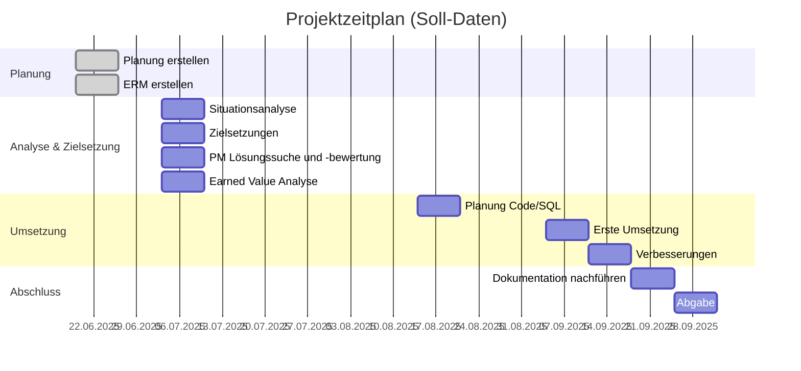
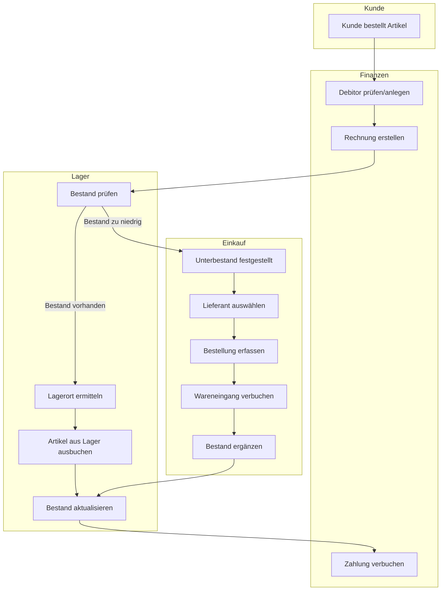
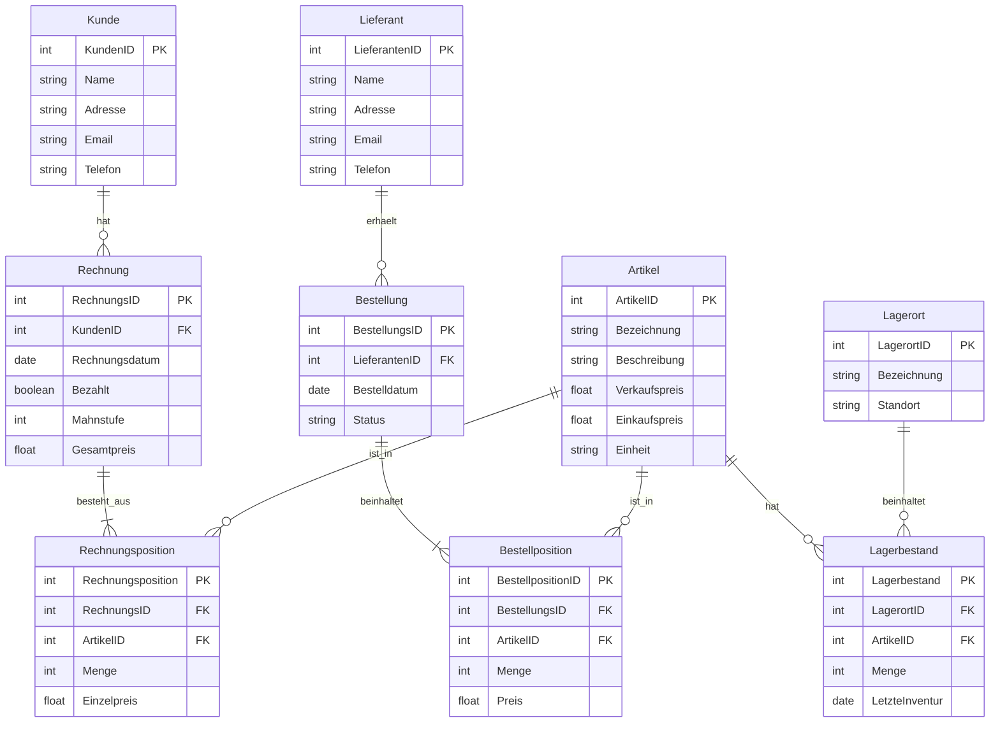

# Arbeitsdokumentation

In dieser Arbeit geht es darum, ein ERP-System aufzubauen, inkl. ERM-Modellierung, Aufbau Datenbank in SQL-Server und Umsetzung mit Testfällen. Allenfalls werde ich gegen Schluss auch noch ein einfaches GUI dazu programmieren. Der Fokus liegt jedoch klar auf dem Aufbau der Datenbank und der Dokumentation.

## Projektmanagement

### Planungsentwurf

Ein erster Entwurf des Ablaufs der Arbeit sieht folgendermassen aus:

1. ERM
   1.1 Leistungsflussdiagramm
   1.2 Korrelationsmatrix
   1.3 Modell
2. Projektmanagement
   2.1 Situationsanalyse
   2.2 Zielsetzungen (Stakeholder und funktional)
   2.3 Lösungssuche und -bewertung (eingeschränkt)
   2.4 Planung und Controlling (Earned Value Analyse)
3. Umsetzung in SQL-Server
   3.1 Datenbank und Tabellen inkl. Pkeys und Fkeys
   3.2 Triggers?
4. Umsetzung in Konsolen-App
   4.1 Verbindung zu DB wie?
5. GUI
   5.1 evtl. mit Blazor?

### Situationsanalyse LittleFlower

Die Firma LittleFlower hat ihren Fokus und ihre Stärke ganz klar auf der kreativen Seite. Super Ideen und schöne Umsetzungen. Was das Administrative anbelangt, wird alles von Hand auf Notizzettel geschrieben - Bestellungen, Rechnungen, Kundendaten, Lieferantendaten etc. Das ist klar ein Problem in der heutigen Zeit. So werden Aufträge vergessen, nicht alles Geld wird eingefordert und die Steuerverwaltung ist nicht zufrieden mit der Buchhaltung.

### Zielsetzungen

**Wen interessiert eine Verbesserung?**

| Stakeholder     | Interesse & Einfluss                                  |
| --------------- | ----------------------------------------------------- |
| Inhaber         | Finanzieller Erfolg                                   |
| Mitarbeitende   | Gute Arbeitsbedingungen, sicherer Job, klare Prozesse |
| IT/Technik-Team | Wartbare Systeme, gute Tools, stabile Infrastruktur   |

**Funktionale Ziele**

| Modul         | Ziel                                                         |
| ------------- | ------------------------------------------------------------ |
| Finanzmodul   | Kreditoren und Debitoren können erfasst und verwaltet werden |
| Finanzmodul   | Umsatz pro Artikel kann generiert werden                     |
| Lagermodul    | Lagerort kann definiert werden                               |
| Lagermodul    | Lagermenge pro Artikel kann verwaltet werden                 |
| Einkaufsmodul | Lieferanten können verwaltet werden                          |
| Einkaufsmodul | Artikelbestellungen können verwaltet werden                  |

### Lösungssuche und -bewertung

Hier werden zwei verschiedene Lösungsansätze aufgeführt und bewertet

#### 1. Abbildung in Excel

Eine Excel-Datei mit drei Blättern:

1. Finanzmodul
   Kreditoren und Debitoren werden erfasst und jede Bestellung wird genau dokumentiert. Es können Diagramme daraus generiert werden.
2. Lagermodul
   Jeder Artikel wird mit Lagerort aufgeführt.
3. Einkaufsmodul
   Lieferanten werden aufgeführt. Alle Bestellungen (Einkäufe) werden dokumentiert.

**Vorteile**:

- sehr simpel
- keine Programmierkenntnisse nötig
- einfach wartbar

**Nachteile**:

- Sicherheit nicht gewährleistet
- Einträge können willkürlich verändert werden
- nicht zeitgemäss
- Auswertungen eingeschränkt
- Logik und GUI nicht trennbar

#### 2. Umsetzung mit relationaler Datenbank (mssql)

Eine genauerer Umsetzungsplan müsste mit einem ERM erstellt werden. Deshalb hier nur grob und stichwortartig. Beziehungen werden typisch relational mit Primär- und Fremdschlüssel verwaltet.

1. Finanzmodul
   Kreditoren, Debitoren sowie Bestellungen werden als eigene Tabellen erfasst. Umsätze können genau ausgewertet werden
2. Lagermodul
   Lagerbestand, Lagerort und Artikel werden als eigene Tabellen erfasst. Lagerbestände können genau ausgewertet werden
3. Einkaufsmodul
   Lieferanten werden als Tabelle geführt

**Vorteile**:

- ausbaufähig
- skalierbar
- grosse Sicherheit kann realisiert werden
- Geschäftslogik gut abbildbar

**Nachteile**:

- Programmierkenntnisse nötig
- je nachdem höhere Wartbarkeit

### Umsetzungsentscheid

Wenn die Vor- und Nachteile der jeweiligen Lösungen gegeneinander abgewogen werden, entscheiden wir uns klar für die Umsetzung mit einer relationalen Datenbank.

### Planung und Controlling

| Aktivität                        | Soll-Datum | Ist-Datum  | Delta | Erklärung                       |
| -------------------------------- | ---------- | ---------- | ----- | ------------------------------- |
| Planung erstellen                | 19.06.2025 | 19.06.2025 | 0     | alles klar                      |
| ERM erstellen                    | 19.06.2025 | 26.06.2025 | 7     | bisschen komplexer als erwartet |
| Situationsanalyse                | 03.07.2025 | 03.07.2025 | 0     | gut vorwärts gekommen           |
| Zielsetzungen                    | 03.07.2025 | 03.07.2025 | 0     | gut vorwärts gekommen           |
| PM Lösungssuche und -bewertung   | 03.07.2025 | 03.07.2025 | 0     | gut vorwärts gekommen           |
| Earned Value Analyse             | 03.07.2025 |            |       |                                 |
| Planung Zusammenspiel Code / SQL | 14.08.2025 | 20.8.25    | 6     | länger gebraucht                |
| Erste Umsetzung                  | 04.09.2025 |            |       |                                 |
| Verbesserungen                   | 11.09.2025 |            |       |                                 |
| Dokumentation nachführen         | 18.09.2025 |            |       |                                 |
| Abgabe                           | 25.09.2025 |            |       |                                 |

### Gantt-Diagramm

## ERM

### Leistungsflussdiagramm

Um überhaupt zu wissen, welche Entitäten benötigt werden stelle ich zuerst das Leistungsflussdiagramm auf.

### ERD

evtl. noch vereinfachen

