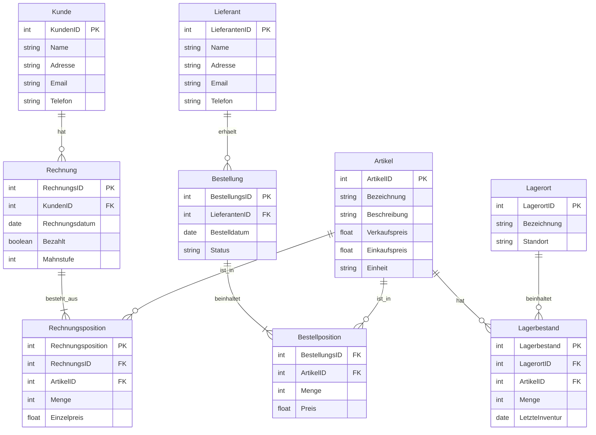

# Arbeitsdokumentation

In dieser Arbeit geht es darum, ein ERP-System aufzubauen, inkl. ERM-Modellierung, Aufbau Datenbank in SQL-Server und Umsetzung mit Testfällen. Allenfalls werde ich gegen Schluss auch noch ein einfaches GUI dazu programmieren. Der Fokus liegt jedoch klar auf dem Aufbau der Datenbank.

## Ablauf

### Entwurf

Ein erster Entwurf des Ablaufs der Arbeit sieht folgendermassen aus:

1. ERM
   1.1 Leistungsflussdiagramm
   1.2 Korrelationsmatrix
   1.3 Modell
2. Projektmanagement
   2.1 Situationsanalyse
   2.2 Zielsetzungen (Stakeholder und funktional)
   2.3 Lösungssuche und -bewertung (eingeschränkt)
   2.4 Planung und Controlling (Earned Value Analyse)
3. Umsetzung in SQL-Server
   3.1 Datenbank und Tabellen inkl. Pkeys und Fkeys
   3.2 Triggers?
4. Umsetzung in Konsolen-App
   4.1 Verbindung zu DB wie?
5. GUI
   5.1 evtl. mit Blazor?

### Planung und Controlling

| Aktivität         | Soll-Datum | Ist-Datum  | Delta | Erklärung                       |
| ----------------- | ---------- | ---------- | ----- | ------------------------------- |
| Planung erstellen | 19.06.2026 | 19.06.2026 | 0     | alles klar                      |
| ERM erstellen     | 19.06.2026 | 26.06.2026 | 7     | bisschen komplexer als erwartet |
|                   |            |            |       |                                 |
|                   |            |            |       |                                 |
|                   |            |            |       |                                 |
|                   |            |            |       |                                 |
|                   |            |            |       |                                 |
|                   |            |            |       |                                 |

## ERM

### Leistungsflussdiagramm

Um überhaupt zu wissen, welche Entitäten benötigt werden stelle ich zuerst das Leistungsflussdiagramm auf.

### ERD

evtl. noch vereinfachen

