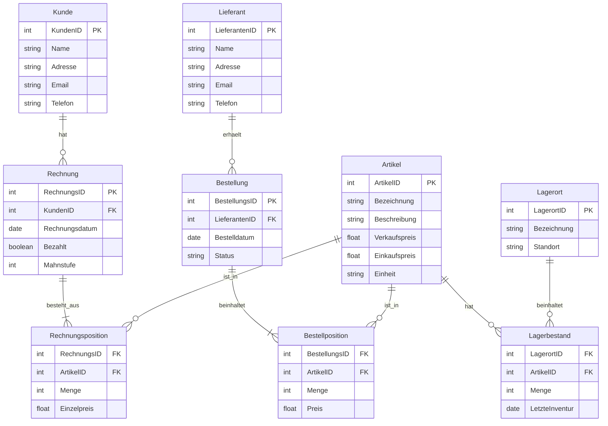

# ERM-Diagramm

evtl. noch vereinfachen

```mermaid
erDiagram
    Kunde ||--o{ Rechnung : hat
    Rechnung ||--|{ Rechnungsposition : besteht_aus
    Artikel ||--o{ Rechnungsposition : ist_in
    Artikel ||--o{ Lagerbestand : hat
    Lagerort ||--o{ Lagerbestand : beinhaltet
    Lieferant ||--o{ Bestellung : erhaelt
    Bestellung ||--|{ Bestellposition : beinhaltet
    Artikel ||--o{ Bestellposition : ist_in

    Kunde {
        int KundenID PK
        string Name
        string Adresse
        string Email
        string Telefon
    }

    Lieferant {
        int LieferantenID PK
        string Name
        string Adresse
        string Email
        string Telefon
    }

    Artikel {
        int ArtikelID PK
        string Bezeichnung
        string Beschreibung
        float Verkaufspreis
        float Einkaufspreis
        string Einheit
    }

    Lagerort {
        int LagerortID PK
        string Bezeichnung
        string Standort
    }

    Lagerbestand {
        int LagerortID FK
        int ArtikelID FK
        int Menge
        date LetzteInventur
    }

    Rechnung {
        int RechnungsID PK
        int KundenID FK
        date Rechnungsdatum
        boolean Bezahlt
        int Mahnstufe
    }

    Rechnungsposition {
        int RechnungsID FK
        int ArtikelID FK
        int Menge
        float Einzelpreis
    }

    Bestellung {
        int BestellungsID PK
        int LieferantenID FK
        date Bestelldatum
        string Status
    }

    Bestellposition {
        int BestellungsID FK
        int ArtikelID FK
        int Menge
        float Preis
    }
```
